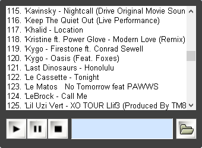

# msplayer
A custom made music player using Win32/C++ :+1:

   
    <h5 align="center">Screenshot from MSPlayer (don't mind about my taste in music)</h5>

Using the code I've found on the internet, I took the initiative and made some improvements like using global hook to hide and show the player, some visual enhancements (it's not that pretty but if it works, that's what matters, right? hehe), changed the way how it handles a list of songs and created a workaround to step the song to the part you wanna hear.  

### :fire: **Shortcut Keys**  

**F12** - Hide music player window  
**Alt + F12** - Show music player window  
**F7** - Go backward in song  
**F8** - Go forward in song  
**F9** - Play/Pause song  
**F10** - Stop song
